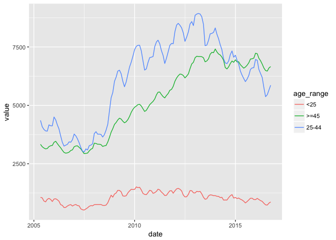

Indicators
================

The data is for Santander and Cantabria.

### Income vs population

Gross income and population in Cantabria.

``` r
library(ggplot2)

data <- read.csv("data/renta_cantabria.csv")
pop <- read.csv("data/pop_cantabria.csv")

# Merge the datasets
merged <- merge(x = data, y = pop, by = "location_id", all.x = TRUE)

# Scatterplot
ggplot(merged, aes(log(value.y), value.x, color = value.x)) +
  geom_smooth(method='lm', color="black", se = FALSE, size = 0.3) +
  geom_point(size = 5, color="darkred", alpha = 0.35)
```


### Age groups

#### Transform excel to csv

``` bash
in2csv --sheet Sheet1 data/pop_edades.xls > data/pop_edades.csv
```

#### Age distribution in Santander

``` r
library(ggplot2)

pop_edades <- read.csv("data/pop_edades.csv")

# Ordered factor
pop_edades$groups <- factor(pop_edades$groups, levels = pop_edades$groups)

# Dot plot
ggplot(pop_edades, aes(pct, groups)) +
  geom_point(size = 3, color="darkred") +
  scale_y_discrete(limits = rev(levels(pop_edades$groups)))
```


``` r
ggplot(pop_edades, aes(groups, pct)) +
  geom_point(size = 3, color="darkred")
```


``` r
# Bar chart
ggplot(pop_edades, aes(groups, pct)) +
  geom_bar(stat = "identity", fill = "darkred")
```


#### Unemployment in Santander

``` r
library(ggplot2)
library(seasonal)
library(zoo)
```

    ## 
    ## Attaching package: 'zoo'

    ## The following objects are masked from 'package:base':
    ## 
    ##     as.Date, as.Date.numeric

``` r
# Load stuff
pop_activa <- read.csv("data/poblacion_activa.csv")
afiliados_ss <- read.csv("data/afiliados_ss.csv")
parados_edad <- read.csv("data/parados_edad.csv")
parados_edad_sexo <- read.csv("data/parados_edad_sexo.csv")
parados_sector <- read.csv("data/parados_sector.csv")
parados <- read.csv("data/parados.csv")

# Fix dates
parados$date <- as.Date(as.yearmon(parados$date))
parados_edad$date <- as.Date(as.yearmon(parados_edad$date))
parados_edad_sexo$date <- as.Date(as.yearmon(parados_edad_sexo$date))
parados_sector$date <- as.Date(as.yearmon(parados_sector$date))
afiliados_ss$date <- as.Date(as.yearmon(afiliados_ss$date))

# Número de parados
ggplot(parados, aes(date, value, group = 1)) + 
  geom_line()
```


``` r
# Seasonally adjusted
adjusted_unemployment <- ts(parados$value, start = c(2005, 5), end = c(2016, 10), freq = 12)
fit <- stl(adjusted_unemployment, s.window="period")
plot(fit)
```


``` r
# ARIMA X13 Seats
# seas(adjusted_unemployment)
# plot(adjusted_unemployment)
# final(adjusted_unemployment)

# Afiliados a la SS
ggplot(afiliados_ss, aes(date, value)) +
  geom_line()
```


``` r
# Parados por grupo de edad
ggplot(parados_edad, aes(date, value, group=age_range, color=age_range)) +
  geom_line()
```



``` r
# Areas
ggplot(parados_edad, aes(date, value, group=age_range, fill=age_range)) +
  geom_area()
```


``` r
# Parados por sector
ggplot(parados_sector, aes(date, value, group=sector, color=sector)) +
  geom_line()
```


``` r
# Flip coordinates
ggplot(parados_sector, aes(date, value, group=sector, color=sector)) +
  geom_line() +
  coord_flip()
```


``` r
# Areas
ggplot(parados_sector, aes(date, value, group=sector, fill=sector)) +
  geom_area()
```


``` r
# Facets
ggplot(parados_sector, aes(date, value, color = sector)) +
  geom_line(size = 0.5) +
  facet_wrap(~ sector, nrow = 1)
```


#### Tasa de paro municipal

``` r
library(ggplot2)
library(zoo)

parados_sector <- read.csv("data/parados_sector.csv")
pop_activa <- read.csv("data/poblacion_activa.csv")

# Extract year from parados_sector
parados_sector$year <- substr(parados_sector$date, 1, 4)
pop_activa$year <- pop_activa$date

# Merge by year
tasa_paro_sector <- merge(parados_sector, pop_activa, by="year", all.y = TRUE)

# Get unemployed pct
tasa_paro_sector$value <- round(tasa_paro_sector$value.x / tasa_paro_sector$value.y * 100, 2)

### In progress
```
