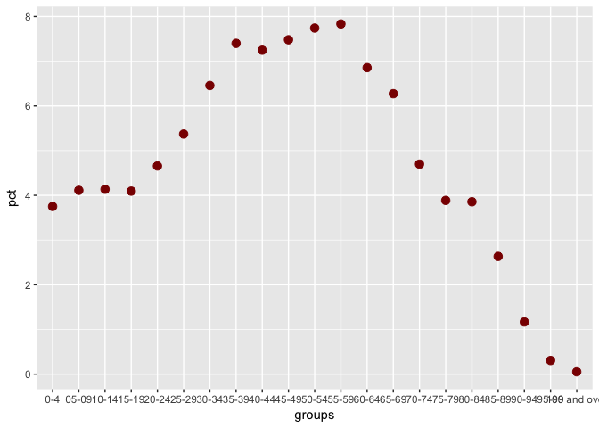

Indicators
================

### Income vs population

Gross income and population in Cantabria.

``` r
library(ggplot2)

data <- read.csv("data/renta_cantabria.csv")
pop <- read.csv("data/pop_cantabria.csv")

# Merge the datasets
merged <- merge(x = data, y = pop, by = "location_id", all.x = TRUE)

# Scatterplot
ggplot(merged, aes(log(value.y), value.x, color = value.x)) +
  geom_smooth(method='lm', color="black", se = FALSE, size = 0.3) +
  geom_point(size = 5, color="darkred", alpha = 0.35)
```


### Age groups

#### Transform excel to csv

``` bash
in2csv --sheet Sheet1 data/pop_edades.xls > data/pop_edades.csv
```

#### Age distribution in Santander

``` r
library(ggplot2)

pop_edades <- read.csv("data/pop_edades.csv")

# Ordered factor
pop_edades$groups <- factor(pop_edades$groups, levels = pop_edades$groups)

# Dot plot
ggplot(pop_edades, aes(pct, groups)) +
  geom_point(size = 3, color="darkred") +
  scale_y_discrete(limits = rev(levels(pop_edades$groups)))
```


``` r
ggplot(pop_edades, aes(groups, pct)) +
  geom_point(size = 3, color="darkred")
```



``` r
# Bar chart
ggplot(pop_edades, aes(groups, pct)) +
  geom_bar(stat = "identity", fill = "darkred")
```

 \#\#\#\# Unemployment in Santander

``` r
library(ggplot2)
library(seasonal)

unemployment <- read.csv("data/desempleo_santander.csv")

ggplot(unemployment, aes(date, value, group = 1)) + 
  geom_line()
```


``` r
# Seasonally adjusted
adjusted_unemployment <- ts(unemployment$value, start = c(2005, 5), end = c(2016, 10), freq = 12)

# seas(adjusted_unemployment)
# plot(adjusted_unemployment)
# final(adjusted_unemployment)

fit <- stl(adjusted_unemployment, s.window="period")
plot(fit)
```


